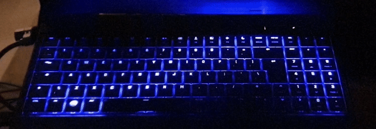

# For ite8291r3-gui check the other branch

**This section fir ite8291r3 will be removed after 01-Oct-2022. Other branch will not be deleted**

Old package is here: https://github.com/salihmarangoz/ite8291r3-gui/tree/ite8291r3-gui

The new app (STE) will include ite8291r3 as an extension with many features. Also, lightbar control, custom scripts, and many things will be available. Custom modules will be able to to access useful events (lid opened, lid closed, before suspend, after suspend, ac adapter plugged in, battery mode, etc.) without effort.


# [STE] System Tray Extensions

System tray toolbox for Linux desktop systems. Currently includes tools for contolling keyboard and lightbar leds but new functions will be added in the future. Share your review here: https://github.com/salihmarangoz/system_tray_extensions/issues/19

**Screenshot of the system tray application:**


**RGB Keyboard Demo:**

[](https://youtu.be/3v0SmxLNwq4)

**RGB Keyboard running a Custom Python Script (`rgb_kb_custom/sin_wave.py`):**



Also here are some other videos for RGB keyboard good for demonstration. Enable `Screen Reflect` effect and watch the video in full-screen:

- https://www.youtube.com/watch?v=2VsZTW6UjcA
- https://www.youtube.com/watch?v=jeQFX9fE7Xc
- https://www.youtube.com/watch?v=5gT3migqxNI


## Modules

| Ready?            | Name (click for readme)                          | Description                                                  |
| ----------------- | ------------------------------------------------ | ------------------------------------------------------------ |
| Mostly            | [Core](modules/Core/README.md)                   | Handles process signals, dbus events, state & configuration files, GUI, etc. |
| Partially         | [UpdateManager](modules/UpdateManager/README.md) | Shows an entry in the STE menu (and optionally via notifications) if an update is available. Hidden otherwise. **Feedback is needed** |
| Mostly            | [Ite8291r3](modules/Ite8291r3/README.md)         | GUI for RGB keyboard led drivers that can control each LED separately. Currently only includes [ite8291r3-ctl](https://github.com/pobrn/ite8291r3-ctl) for `048d:6004` and `048d:ce00`. Can visualize custom .png, .mp4 and .py files. Also this module can be extended for new devices if there is a driver exists for it. |
| Only for LightBar | TuxedoKeyboard                                   | GUI for controlling [tuxedo-keyboard](https://github.com/tuxedocomputers/tuxedo-keyboard). Currently includes controls for Light-bar. See [this webpage](https://www.tuxedocomputers.com/en/Infos/Help-Support/Instructions/Installation-of-keyboard-drivers-for-TUXEDO-Computers-models-with-RGB-keyboard-.tuxedo) for more information. |
| Partially         | DgpuPowerstateMonitor                            | Adds an icon to system tray if dGPU is enabled. Only works or Nvidia for now. |
| Partially         | BatteryPowerDrawMonitor                          | Adds an icon to system tray showing power drawn from the battery. Hides itself on AC. |
|                   | Script Manager                                   | todo                                                         |


## Installation

Start a new terminal session and use it for all commands above. If you want to run these in multiple terminals don't forget to define `INSTALL_DIR`.

```bash
# 0. Specify installation directory
$ INSTALL_DIR="$HOME/.system_tray_extensions"

# 1. Download the project
$ sudo apt install git
$ git clone https://github.com/salihmarangoz/system_tray_extensions.git "$INSTALL_DIR"
# OR
$ git clone git@github.com:salihmarangoz/system_tray_extensions.git "$INSTALL_DIR"

# Next steps are included in the script:
$ cd $INSTALL_DIR
$ bash install.sh
```


## Enable Write Permissions for `/sys/class/leds/`

For controlling Tuxedo Keyboard it is needed to enable write permissions. 

- Create a new udev rule:

```bash
$ sudo nano /etc/udev/rules.d/99-ste-tuxedokeyboard.rules
```

- Copy and paste everything here:

```
SUBSYSTEM=="leds", ACTION=="add", RUN+="/bin/chgrp -R leds /sys%p", RUN+="/bin/chmod -R g=u /sys%p"
SUBSYSTEM=="leds", ACTION=="change", ENV{TRIGGER}!="none", RUN+="/bin/chgrp -R leds /sys%p", RUN+="/bin/chmod -R g=u /sys%p"
```

- Create `leds` group and add current user to it. 

```bash
$ sudo groupadd leds
$ sudo usermod -a -G leds $USER
```

- Logout and login again. (or reboot the system)


## Update

Backup your installation before updating if you modified existing files. If you added new files it is OK. But, for example, if you modified some files (e.g. presets inside rgb_kb_custom) create a file named `.gitignore` and write `*` and place into that folder.

```bash
$ INSTALL_DIR="$HOME/.system_tray_extensions"
$ cd $INSTALL_DIR
$ git pull
$ bash install.sh
```


## Running

You can start the app via launcher. Also, the app will start on boot by default. If you want to start via terminal then run this command:

```bash
$ bash start.sh
```


## Contributing

Contributions of any kind are welcome. See **ToDo List** for current problems/ideas. Also see [CONTRIBUTING.md](CONTRIBUTING.md)

**Contributors:**

- No one.

**ToDo List:**

- [ ] Core: Check hibernate/wakeup if it works.
- [ ] RgbKeyboard: Keyboard shortcuts for effects? "Save this state to shortcut: xyz"?
- [x] DgpuPowerstateMonitor
- [x] BatteryPowerDrawMonitor
- [ ] TogglePulseaudioSuspend
- [ ] App: Logging has some problems. Not working?!
- [x] RgbKeyboard: Report brightness in the menu and modify brightness.
- [x] RgbKeyboard: low battery alert (gave up)
- [x] RgbKeyboard: Run screen mimic when screensaver starts on ac mode. (gave up... may use a lot of resources for nothing)
- [x] Core: Add callback in an anonymous way
- [x] *: Manage settings and module states.
- [x] CheckUpdates: Show QtAction if update is available. Check every 6 hrs. (kinda ok.)
- [x] App: Add on boot entry for start.sh
- [x] App: Add desktop entry for start.sh
- [x] App: We need an ICON.
- [x] Import RgbKeyboard modules only when needed. (if another drivers are added) (gave up. make the project as much as simple, make users install all deps)


## Known Issues

- `tdp` package is causing rgb keyboard video playing or screen reflect features to stop.


## Credits

Credit goes to [Ambiefix](https://www.youtube.com/channel/UCnwLT9GEwbzfjPusVKtxacA) for preset videos used in the RGB Keyboard module:

- [Youtube: Aurora Borealis Inspired Ambient Animation Video Backdrop Loop (60 min/No sound) - Free Footage](https://www.youtube.com/watch?v=X6PLRiil2F4)
- [Youtube: Rotating Colorful Waves - Rainbow Lines - Motion Graphics Video Background](https://www.youtube.com/watch?v=sTsO_NMjb3o)
- [Youtube: Blurred Lines Spaghetti Ambient Mood Light Video Loop (2 Hours/No Sound)](https://www.youtube.com/watch?v=Nw9vgfbPf90)

Credit goes to [MrPacMan36](https://www.youtube.com/channel/UC7GfgbTJuA6_gi2XEaBcNRw) for the video used in the RGB Keyboard demo video:

- [Youtube: Fluid Sim Hue Test](https://www.youtube.com/watch?v=qC0vDKVPCrw)


## References

- https://approxeng.github.io/approxeng.input/sys.html
