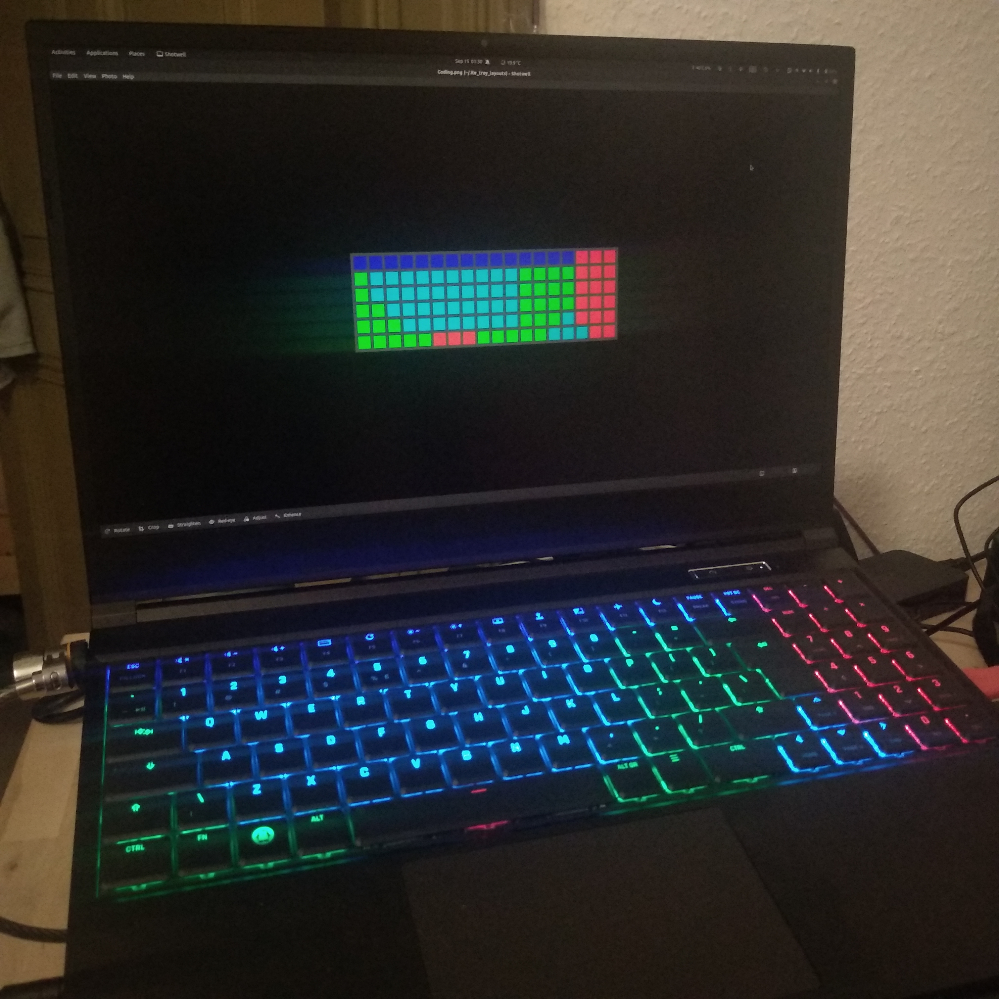

# ite8291r3-gui

**GUI for [ite8291r3-ctl](https://github.com/pobrn/ite8291r3-ctl)**


## Check Device Compatibility

This command should return an entry similar to `Bus 003 Device 004: ID 048d:6004 Integrated Technology Express, Inc.` Nothing returning means you may not have compatible devices. If you find similar drivers to `ite8291r3-ctl` I can add them to the project, open an issue for it.

```bash
$ lsusb | grep -e 048d:6004 -e 048d:ce00
```


## Install/Update

```bash
$ pip3 install ite8291r3-ctl PyQt5 pyusb numpy pillow
$ git clone https://github.com/salihmarangoz/ite8291r3-gui -b ite8291r3-gui
$ cd ite8291r3-gui
$ bash install.sh
```

- Currently there is no saving feature. If you would like to setup a default mod then run `sudo crontab -e`  and add this line:

```
@reboot /usr/local/bin/ite8291r3-ctl effect rainbow
```


## Running

App will start on boot by default. You can start it just after the installation with this command:

```bash
$ nohup python3 $HOME/.local/share/ite8291r3_gui/ite_tray.py # then close the terminal
```


## Custom Layouts

- Custom layouts are located at `~/.ite_tray_layouts`. 
- Copy `default.png`, rename and modify using Gimp or a similar image editing software.
- Deleting `default.png` triggers generating it again. 
- Some cells may not be mapped to a RGB light, do not worry. 
- This app only reads center pixels of the cells. Do not worry about the edges.





## Extra: Lightbar for Stellaris 15

Currently lightbar is not managed by this app. However you can add an animation to the lightbar.

- Make sure `tuxedo_keyboard` is installed.

```
sudo crontab -e
```

- Add this line then save

```
# ENABLE LIGHTBAR ANIMATION
@reboot echo 1 > /sys/devices/platform/tuxedo_keyboard/leds/lightbar_animation::status/brightness
```

- Reboot
- Also another good idea for using the lightbar: https://github.com/salihmarangoz/ite8291r3-gui/issues/1#issuecomment-919353029


## To-Do

- Remember the last state.
- Frequently used effects, colors.
- Better gamma correction. (I don't have any device to calibrate it. Also this is not a solution. But better estimations would be nice.)
- Report brightness in the menu. And put "+" and "-" into the same entry.
- Update checking feature.
- pip3 install to virtual environment?
- Start on boot enable/disable button.
- Keyboard shortcuts for effects? "Save this state to shortcut: xyz"
- Report cpu/gpu temps and battery state
- Alerts for low battery
- Sound spectrum analyzer
- Forwards logs to journalctl or to a file.
- Control lightbar if it is detected.

**Rework Path:**

- Install will be done via `git clone` and `bash install.sh`, update will be done via `git pull` 
- $HOME/.rgb_keyboard_gui/custom_presets (png, py, .gitignore?)
- $HOME/.rgb_keyboard_gui/settings.ini
- $HOME/.rgb_keyboard_gui/app.py
- $HOME/.rgb_keyboard_gui/venv (optional) (.gitignore?)
- ite8291r3-ctl will wrapped in a Driver class. Project may support other drivers in the future.
- change project name to rgb_keyboard_gui
