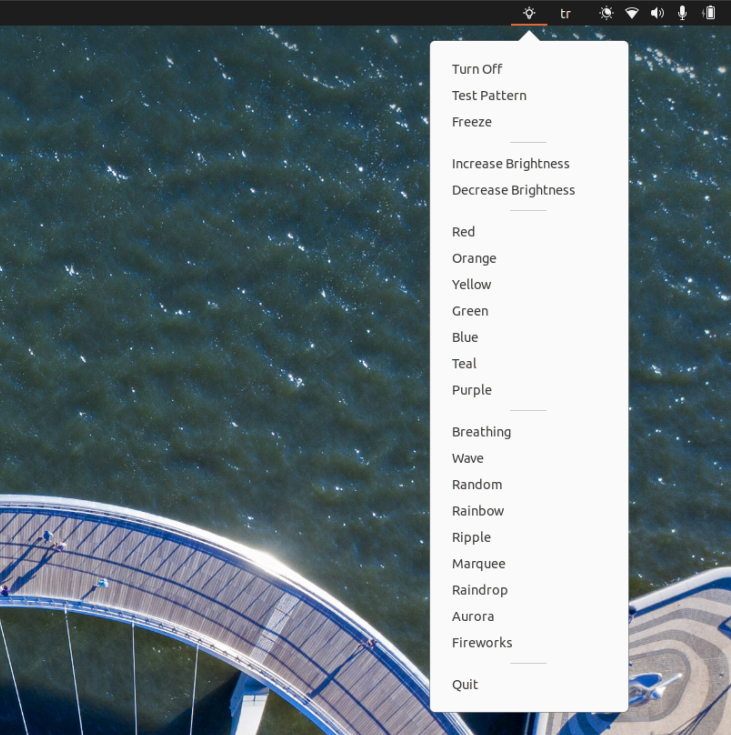

# ite8291r3-gui

**Image below may be outdated**



**Tested on Tuxedo Stellaris 15. Still in development!**

- Install dependencies

```
pip install ite8291r3-ctl PyQt5 pyusb python-is-python3
```

- Create a file `/etc/udev/rules.d/99-ite8291.rules`:

```
SUBSYSTEMS=="usb", ATTRS{idVendor}=="048d", ATTRS{idProduct}=="ce00", MODE:="0666"
SUBSYSTEMS=="usb", ATTRS{idVendor}=="048d", ATTRS{idProduct}=="6004", MODE:="0666"
```

- You can reboot and run `ite8291r3-ctl test-pattern` for testing if installation was done correclty.
- Install the system tray application:

```python
$ sudo cp tray.py /usr/local/bin/ite_tray.py
$ sudo cp icon.png /usr/local/etc/ite_tray_icon.png
```

- Open `Startup Applications Preferences` and add the application
  - Name: `ite_tray`
  - Command: `/usr/bin/python3 /usr/local/bin/ite_tray.py`
- Currently there is no saving feature. If you would like to setup a default mod then run `sudo crontab -e`  and add this line:

```
# DEFAULT KEYBOARD BACKLIGHT MODE AFTER REBOOT
@reboot /usr/local/bin/ite8291r3-ctl effect rainbow
```

- Reboot


# Extra: Lightbar for Stellaris 15

- Make sure `tuxedo_keyboard` is installed.

```
sudo crontab -e
```

- Add this line then save

```
# ENABLE LIGHTBAR ANIMATION
@reboot echo 1 > /sys/devices/platform/tuxedo_keyboard/leds/lightbar_animation::status/brightness
```

- Reboot

